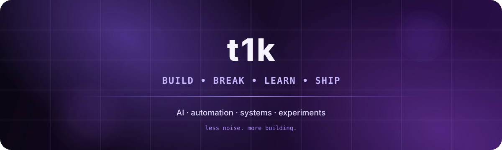

<div align="center">



<br/>


<br/>

[](https://github.com/t1ktakdev)
[](https://github.com/t1ktakdev?tab=followers)

</div>

---

### ✦ about me

```yaml
name: t1k
focus:
  - ai & local llms
  - automation
  - developer tooling
  - beautiful interfaces
  - experiments that feel impossible at first

currently:
  building: useful things
  learning: "whatever the project needs"
  vibe: "dark / purple / minimal / fast"
```

### ✦ stack

<div align="center">


</div>

### ✦ stats

<div align="center">


</div>

### ✦ contribution flow

<div align="center">

<picture>
  <source media="(prefers-color-scheme: dark)" srcset="https://raw.githubusercontent.com/t1ktakdev/t1ktakdev/output/github-contribution-grid-snake-dark.svg">
  <source media="(prefers-color-scheme: light)" srcset="https://raw.githubusercontent.com/t1ktakdev/t1ktakdev/output/github-contribution-grid-snake.svg">
  
</picture>

</div>

### ✦ now

```text
> experimenting with local AI
> building a clean coding setup
> turning ideas into actual projects
```

<div align="center">

<br/>

<sub>✦ less noise. more building. ✦</sub>

</div>
